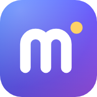

# Melo



Application **à tout faire**, personnalisable de fond en comble : un **accueil en tableau de bord** (widgets à placer et redimensionner librement, fond d’écran, thèmes de couleurs), des **notes** (pages imbriquées, éditeur par blocs, commande `/`, partage avec modification en direct), un **agenda** (Google et iCal), la **maison connectée**, les **caméras de surveillance**, le **homelab** et un **atelier PDF**, chacun dans sa section. Fonctionne sur le web, comme application Windows, comme application Android (APK) et comme application installée depuis le navigateur (Windows, Mac, Linux).

## Télécharger Melo

| Appareil | Fichier | Installation |
| --- | --- | --- |
| **Ordinateur Windows** | [Melo-Windows.exe](https://github.com/ShinezeoGame/Notes/releases/download/latest/Melo-Windows.exe) | Ouvrez le fichier. Si Windows affiche « Windows a protégé votre ordinateur » : **Informations complémentaires**, puis **Exécuter quand même**. Melo s’installe tout seul (sans droits d’administrateur) et s’ouvre ; il se retrouve ensuite sur le bureau et dans le menu Démarrer. |
| **Téléphone Android** | [Melo-Android.apk](https://github.com/ShinezeoGame/Notes/releases/download/latest/Melo-Android.apk) | Ouvrez le fichier sur le téléphone, autorisez l’installation depuis cette source si on vous le demande, puis **Installer**. |
| **Navigateur** (tout appareil) | aucun | Ouvrez l’adresse d’un serveur Melo (le vôtre ou celui d’un proche). Sur ordinateur, **Installer l’application** en bas de la barre de gauche en fait une application. |

Toutes les versions, avec ces instructions : **[page de téléchargement](https://github.com/ShinezeoGame/Notes/releases/tag/latest)** (rubrique *Assets*). Une nouvelle version s’installe par‑dessus l’ancienne : vos pages sont gardées.

> **Dépôt privé** : ces liens ne s’ouvrent que pour les personnes qui ont accès au dépôt sur GitHub (connectées à leur compte). Pour donner l’application à quelqu’un : ajoutez‑le au dépôt (**Settings → Collaborators → Add people**), ou rendez le dépôt public (**Settings → General → Danger Zone → Change repository visibility**) pour qu’un simple lien suffise ; l’application Windows se met alors aussi à jour toute seule.

## Premiers pas

1. Au premier lancement, **Commencer** : Melo fonctionne tout de suite, sur cet appareil. Vous avez reçu un lien ou un code ? **J’ai une invitation ou un code**.
2. Indiquez votre prénom et cochez ce que vous allez utiliser : seules ces sections s’affichent (**Personnaliser → Sections** pour changer d’avis).
3. Une courte présentation montre l’essentiel ; revoyez‑la quand vous voulez : **Réglages → Revoir la présentation**.
4. La barre de gauche réunit les sections par usage : **Accueil** ; **Organisation** (Notes, Agenda) ; **Maison** (Objets connectés, Caméras, Homelab) ; **Outils** (Atelier PDF). Sur téléphone : onglets en bas de l’écran, le reste dans **Plus**.

## Partager

- **Une page** : bouton **Partager** → **Peut modifier** ou **Peut seulement lire** → **Copier le lien** (ou **Envoyer…**). La personne l’ouvre dans son navigateur, sans compte ni installation, et voit les modifications en direct. Le lien donne accès à la page et à ses sous‑pages ; **Désactiver** (même fenêtre) coupe l’accès.
- **Vos appareils** (téléphone, autre ordinateur) : **Réglages → Relier un autre appareil** → scannez le QR code avec l’appareil photo du téléphone, ou collez le lien dans l’application (**J’ai une invitation ou un code**). Valable 10 minutes, une seule fois.
- **Une personne** : **Réglages → Inviter une personne** → envoyez le lien (valable 7 jours, pour une personne). Elle obtient son propre espace, privé, sur votre serveur, le retrouve sur tous ses appareils, et vous pouvez vous partager des pages. Elle n’a accès ni à votre maison, ni à vos caméras, ni à votre homelab. **Retirer** (même rubrique) supprime son espace du serveur.

Le partage passe par un serveur Melo joignable par les autres : le vôtre (**[INSTALLATION.md](INSTALLATION.md)**), ou celui de la personne qui vous invite. Melo utilisé seul sur un appareil (application Windows ou Android, sans serveur) garde tout sur cet appareil ; **Réglages → Rejoindre un serveur** le relie plus tard.

## Fonctionnalités

- **Accueil personnalisable** : un tableau de bord de widgets — horloge (numérique ou à aiguilles, autre fuseau horaire), météo, agenda, tâches, note rapide (post-it), page de notes modifiable sur place, pages récentes, recherche sur le web, raccourcis, image, site web intégré, caméras, maison, homelab. À la souris, glissez un widget pour le déplacer et tirez l’un de ses coins pour le redimensionner, sans bouton à activer ; sur téléphone, un appui long sur un widget passe en mode modification. Ajoutez-en depuis le catalogue, réglez ou retirez chacun. La disposition est gardée pour chaque taille d’écran (ordinateur, tablette, téléphone) et l’accueil est le même sur tous vos appareils. À l’intérieur des widgets, glissez un élément (appareil, groupe, caméra, application, raccourci, tâche) pour changer sa place.
- **Personnaliser** : sept thèmes de couleurs (sombre, noir, bleu nuit, forêt, clair, crème, lavande), couleur d’accent au choix, **fond d’écran** (image envoyée, adresse d’une image, dégradé ou couleur ; flou et voile réglables ; sur l’accueil ou dans toute l’application), transparence, flou, arrondi et espacement des widgets, taille du texte, ordre et choix des sections affichées. Chaque changement s’affiche aussitôt et vaut pour tous les appareils reliés.
- **Sections**, réunies par usage : Accueil ; Organisation (Notes, Agenda) ; Maison (Objets connectés, Caméras, Homelab) ; Outils (Atelier PDF). Sur ordinateur, barre à gauche (repliable en icônes avec la flèche du haut) ; sur téléphone, onglets en bas de l’écran (les autres sections dans **Plus**). Au premier lancement, on coche les sections utiles et une courte présentation montre l’essentiel.
- **Agenda** (section « Agenda ») : vos agendas Google et adresses iCal (Outlook, Apple, école, travail…) réunis, en vue du mois ou en liste, chacun avec sa couleur, masquable et actualisable ; widget sur l’accueil.
- **Éditeur par blocs** (BlockNote) : titres, listes, cases à cocher, citations, code, tableaux, séparateurs, couleurs, emojis… Tapez `/` pour ouvrir le menu de commandes, glissez les blocs avec la poignée `⠿`.
- **Colonnes** : placez des blocs côte à côte (un texte à côté d’une image, une vidéo à côté d’un module homelab…). Glissez un bloc par sa poignée `⠿` contre le bord droit ou gauche d’un autre bloc (une barre verticale apparaît ; à côté d’un module rétréci — agenda, caméras, homelab… — déposez-le dans l’espace libre à sa droite), ou tapez `/2 colonnes` ou `/3 colonnes` ; jusqu’à 4 colonnes par rangée. Largeur des colonnes : tirez la séparation entre deux colonnes, ou menu `⠿` d’un bloc > *Largeur de la colonne* (un quart à trois quarts, parts égales). Sortez le dernier bloc d’une colonne et elle disparaît. Sur téléphone, les colonnes s’affichent l’une sous l’autre.
- **Pages dans des pages** (section « Notes ») : bouton `+` en haut de la liste des pages, bouton « Nouvelle sous-page » en bas de chaque page, ou commande `/Sous-page` pour insérer un lien de page dans le contenu. Arborescence réorganisable par glisser‑déposer, fil d’Ariane, recherche (`Ctrl+K`), corbeille avec restauration.
- **Médias** : images et GIF (`/Image`, glisser‑déposer ou coller), vidéos (`/Vidéo`), audio, fichiers, **PDF avec aperçu intégré** (`/PDF`), **intégrations** YouTube, Vimeo, Dailymotion, Google Drive/Docs, Google Agenda (iframe), Loom, Spotify, Figma… (`/YouTube`).
- **Agenda dans une page** (`/Agenda`) : import d’un fichier `.ics` exporté, d’une **adresse secrète iCal** (bloc actualisable d’un clic), ou directement depuis votre **compte Google** (OAuth, si vous renseignez un ID client) : cochez un ou plusieurs agendas, ou « Tout sélectionner », ils sont réunis dans un même bloc avec leurs couleurs. Les événements s’affichent par jour, avec la mise en avant du jour courant ; **Ajouter à l’Agenda** le reprend dans la section Agenda.
- **Collaboration en direct** : chaque page est un document CRDT (Yjs). Partagez une page en « modification » ou en « lecture seule » ; les invités voient les curseurs et les prénoms des autres participants et peuvent créer des sous-pages (mode modification).
- **Invitations** : le propriétaire d’un serveur Melo donne à un proche son propre espace sur ce serveur, par un simple lien (ou QR code) ; relier ses propres appareils se fait de la même façon (QR code, lien ou code à 6 chiffres).
- **Hors ligne d’abord** : tout est stocké localement (IndexedDB) et synchronisé dès qu’un serveur est joignable. Plusieurs appareils peuvent être liés au même espace.
- **Pleine largeur** : les pages occupent toute la largeur de l’écran ; menu `⋯` d’une page > *Pleine largeur* pour revenir à une colonne centrée (réglage propre à chaque page, également appliqué aux invités d’un lien de partage).
- **Bannières et logos** : bannière en haut de chaque page (bouton *Ajouter une bannière* au survol du titre) avec votre propre image (importée, glissée ou collée) ou un dégradé, repositionnable en faisant glisser l’image, hauteur réglable avec la poignée sous la bannière (double-clic : hauteur automatique) ; logo de page avec votre image (icône de la page → onglet *Image*), recadré à votre goût avant utilisation (glisser l’image, zoom au curseur, à la molette ou à deux doigts, aperçu en direct ; bouton *Recadrer* pour y revenir plus tard, à partir de l’image d’origine), taille de l’icône réglable (curseur *Taille*, de 32 à 200 px), aussi pour les applications du homelab. Les images sont réduites automatiquement avant l’envoi.
- **Redimensionnement** : taille du texte des paragraphes, titres et listes (menu ⠿ du bloc > *Taille du texte*, ou liste *Normal* de la barre de mise en forme sur une sélection) ; largeur des images et vidéos (poignées latérales, menu ⠿ > *Largeur*, ou liste de la barre d’outils : 25 à 100 %) ; largeur (au pourcent près) et hauteur des blocs PDF, vidéo intégrée, agenda et homelab (poignées à droite et en bas) ; modules du homelab en taille libre (bouton *Redimensionner*, puis tirer le bord droit, le bord inférieur ou le coin d’un module ; flèches du clavier sur le coin ; double-clic sur le coin pour revenir à la taille automatique). Les modules s’emboîtent sans laisser de trou, un module agrandi affiche plus de statistiques et, sur téléphone, les modules s’empilent.
- **Maison connectée** (section « Objets connectés » du groupe Maison, widget « Maison » de l’accueil, ou bloc `/Maison` dans une page) : lumières (marche/arrêt, luminosité, couleur, température de blanc), prises et interrupteurs, volets, thermostats, serrures, enceintes, aspirateurs, scènes, capteurs (température, humidité, portes, mouvement…) et caméras (image et vidéo en direct), regroupés par pièce, avec favoris et recherche. **Groupes** d’appareils (toutes les lumières du salon, les prises du bureau, les volets…) : un seul interrupteur allume ou éteint tout, luminosité et couleur communes, tout ouvrir ou fermer. Appareils, groupes et favoris se réordonnent par glisser-déposer. Fonctionne avec Home Assistant, qui prend en charge la plupart des marques (Philips Hue, IKEA, Tapo, Tuya/Smart Life, Shelly, Xiaomi, Netatmo, caméras ONVIF…).
- **Caméras de surveillance** (section « Caméras », widget de l’accueil, ou bloc `/Caméra` dans une page) : direct de vos caméras IP et enregistreurs reliés directement au serveur Melo, sans Home Assistant (Hikvision, Dahua, Reolink, Tapo, Ezviz, Foscam, Uniview, Axis, ou toute caméra avec un flux RTSP ou MJPEG), en grille ou en grand, avec un essai de connexion qui montre une image avant d’enregistrer. Le direct reste chargé quand vous passez à une autre fenêtre, et l’ordre des caméras se change par glisser-déposer.
- **Homelab** (section « Homelab », widget de l’accueil, ou bloc `/Homelab` dans une page) : état et statistiques de vos applications (Sonarr, Radarr, Lidarr, Readarr, Prowlarr, Bazarr, Jellyfin, Emby, Plex, Jellyseerr, Overseerr, qBittorrent, Transmission, Pi-hole, AdGuard Home, Portainer, Home Assistant, Uptime Kuma, Nextcloud, Immich, ou n’importe quelle URL) et de vos appareils (CPU, mémoire, disques, températures, uptime) via Glances, Proxmox VE, Synology DSM, TrueNAS ou l’hôte du serveur Melo lui-même. Glissez un module pour changer sa place.
- **Atelier PDF** (section « Atelier PDF » du groupe Outils) : importez des PDF (même protégés par un mot de passe) ou des photos (**Photos → PDF**, **Scanner un document** avec l’appareil photo du téléphone), réorganisez les pages (ordre, rotation, suppression, pages blanches, assemblage de plusieurs PDF, extraction de pages), annotez (texte, surligneur, stylo, masque, coches, images), **signez** (signature dessinée une fois, gardée pour les fois suivantes), **remplissez les formulaires**, puis exportez un nouveau PDF (enregistrer, partager). L’original n’est jamais modifié et vos modifications restent modifiables.
- **Android** : application native via Capacitor, APK construit automatiquement par GitHub Actions, et testé sur un émulateur Android 14 (lancement, liaison au serveur, notification, mise à jour, fichiers de l’atelier PDF) avant d’être publié.
- **Windows** : application à installer (`Melo-Windows.exe`), avec son propre serveur intégré : tout fonctionne sur l’ordinateur, sans serveur ni compte ; ou reliée à votre serveur (ou à celui d’un proche). PDF ouverts avec Melo depuis l’Explorateur. Construite et essayée sur Windows par GitHub Actions avant chaque publication.
- **Windows, Mac, Linux (navigateur)** : application installable depuis Edge, Chrome ou Brave (bouton **Installer l’application** en bas de la barre des sections) : fenêtre à part, icône dans le menu Démarrer, ouverture même sans réseau, mises à jour automatiques depuis le serveur.
- **Mises à jour sans réinstaller** : quand le serveur est mis à jour, l’application Android reçoit une notification « Mise à jour de Melo disponible » et se met à jour d’un geste, en téléchargeant la nouvelle version depuis votre serveur ; les navigateurs ouverts proposent de recharger la page.

## Démarrage rapide (ordinateur)

Prérequis : Node.js 20 ou plus.

```bash
npm install
npm run build     # construit le client web dans client/dist
npm start         # démarre le serveur sur http://localhost:3000
```

Ouvrez http://localhost:3000. Pour le développement avec rechargement à chaud : `npm run dev` (client sur http://localhost:5173, serveur sur le port 3000).

Variables d’environnement du serveur :

| Variable | Rôle | Défaut |
| --- | --- | --- |
| `PORT` | Port d’écoute | `3000` |
| `DATA_DIR` | Dossier des données (documents, uploads, liens de partage) | `server/data` |
| `PUBLIC_URL` | Adresse publique (utilisée pour les liens de partage et d’upload derrière un proxy) | déduite de la requête |
| `MAX_UPLOAD_MB` | Taille maximale d’un fichier importé | `200` |
| `MAX_WORKSPACES` | Nombre maximal d’espaces de travail (`0` = illimité), sans compter ceux créés par une invitation. Mettez `1` sur un serveur accessible depuis Internet : les autres personnes passent par une invitation | `0` (Docker : `1`) |

### Déployer le serveur (pour partager et synchroniser)

Le partage de pages et la synchronisation entre appareils nécessitent que le serveur soit joignable par les autres (Internet ou réseau local).

**Guide pas à pas (serveur maison + accès depuis Internet en HTTPS) : [INSTALLATION.md](INSTALLATION.md).**

- **Docker** : `cp .env.example .env`, adaptez-le, puis `docker compose up -d --build` (données dans le dossier `./data`). Pour l’accès HTTPS depuis Internet : `docker compose --profile tunnel up -d` (Cloudflare Tunnel), `docker compose --profile caddy up -d` (Caddy), ou `sudo tailscale funnel --bg 3000` (Tailscale Funnel, sans nom de domaine).
- **Hébergeurs Node** (Render, Railway, Fly.io, VPS…) : commande de build `npm install && npm run build`, commande de démarrage `npm start`, et un disque persistant monté sur `DATA_DIR`.
- **Réseau local uniquement** : `npm start` sur votre ordinateur, puis utilisez `http://<ip-de-l-ordinateur>:3000` depuis le téléphone (même Wi‑Fi).

## Application Android (APK)

L’APK est construit automatiquement par le workflow GitHub Actions `Applications (Android, Windows)` à chaque push. Dernière version : **https://github.com/ShinezeoGame/Notes/releases/tag/latest** (fichier `Melo-Android.apk`).

Détail :

1. Onglet **Actions** du dépôt → dernier run → artefact `notes-apk`, **ou** onglet **Releases** : chaque branche publie une pré-release `apk-<branche>` (et `latest` pour la branche principale) contenant `Melo-Android.apk`.
2. Sur le téléphone, téléchargez `Melo-Android.apk`, autorisez l’installation depuis des sources inconnues, installez.
3. Au premier lancement, choisissez **Commencer** (Melo sur ce téléphone seul, sans serveur) ou **J’ai une invitation ou un code** : collez le lien reçu (invitation, ou liaison affichée par *Réglages → Relier un autre appareil* sur un appareil déjà relié), ou saisissez l’adresse du serveur puis le **code à 6 chiffres**, pour retrouver exactement les mêmes pages. Une application déjà installée se relie depuis *Réglages → Saisir un lien ou un code*.

### Mises à jour de l’application

Il n’est plus nécessaire de retélécharger l’APK à chaque nouvelle version :

1. Le serveur se met à jour : automatiquement toutes les 15 minutes après `sh scripts/install-auto-update.sh` (une fois), ou à la main avec `git pull && docker compose up -d --build` (voir [INSTALLATION.md](INSTALLATION.md)).
2. Le téléphone vérifie la version du serveur toutes les heures et affiche la notification **Mise à jour de Melo disponible** (autorisation demandée au premier lancement ; option dans *Réglages → Application et mises à jour*).
3. Touchez la notification, ou le bouton **Mettre à jour** du bandeau affiché dans l’application : la nouvelle version (environ 6 Mo) est téléchargée depuis le serveur, vérifiée fichier par fichier (SHA-256), puis l’application redémarre dessus. Vos notes restent sur l’appareil.

Si la nouvelle version ne démarre pas, l’application revient à la précédente au lancement suivant. Seules les évolutions de la partie native Android (rares) demandent d’installer un nouvel APK : l’application le signale alors avec un lien de téléchargement. Dans un navigateur, un bandeau **Recharger** apparaît quand le serveur a été mis à jour.

Quand une version apporte un nouveau type de bloc (les colonnes, les caméras…), un appareil resté sur l’ancienne version ne synchronise plus les pages tant qu’il n’est pas mis à jour (bandeau *Mettre à jour*) : il effacerait sinon les blocs qu’il ne connaît pas. Ses modifications restent sur l’appareil et sont envoyées après la mise à jour.

Options facultatives (Settings → Secrets and variables → Actions) :

- Variable `DEFAULT_SERVER_URL` : adresse de serveur pré-remplie dans l’APK.
- Variable `GOOGLE_CLIENT_ID` : ID client OAuth Google pré-rempli.
- Secrets `ANDROID_KEYSTORE_BASE64`, `ANDROID_KEYSTORE_PASSWORD`, `ANDROID_KEY_ALIAS`, `ANDROID_KEY_PASSWORD` : produisent en plus un `Melo-Android-signe.apk` signé.

Construction locale (nécessite Android Studio / SDK Android et Java 21) : `npm run android:apk` → `android/app/build/outputs/apk/debug/app-debug.apk`. `npm run android:open` ouvre le projet dans Android Studio.

L’APK debug est signé avec une clé de debug versionnée (`android/app/debug.keystore`) pour que les mises à jour s’installent par‑dessus sans désinstaller.

## Application Windows

`Melo-Windows.exe` ([dernière version](https://github.com/ShinezeoGame/Notes/releases/tag/latest)) installe Melo pour l’utilisateur de l’ordinateur, sans droits d’administrateur : raccourcis sur le bureau et dans le menu Démarrer, **Ouvrir avec → Melo** pour les PDF (importés dans l’atelier PDF), désinstallation par *Paramètres Windows → Applications*.

- **Sur cet ordinateur** (**Commencer**) : Melo embarque son propre serveur, lancé en arrière-plan et joignable de cet ordinateur seulement. Toutes les sections fonctionnent sans serveur ni compte, y compris l’atelier PDF, la maison connectée, le homelab et les caméras (celles-ci demandent [ffmpeg](https://www.gyan.dev/ffmpeg/builds/) dans le PATH, sauf les caméras à images ou MJPEG). Les données sont dans `%APPDATA%\Melo\data` : c’est ce dossier qu’il faut sauvegarder.
- **Sur un serveur** (**J’ai une invitation ou un code**, ou *Réglages → Rejoindre un serveur*) : la fenêtre affiche le serveur choisi, toujours à jour, comme l’application installée depuis le navigateur. *Réglages → Revenir à l’espace de cet ordinateur* y ramène ; les deux espaces restent séparés. Serveur injoignable au démarrage : une page propose de réessayer ou de revenir à l’espace de l’ordinateur.
- **Mises à jour** : si le dépôt GitHub est public, Melo télécharge les nouvelles versions en arrière-plan et les installe à la fermeture (bandeau **Redémarrer** pour le faire tout de suite). Sinon, installez la nouvelle version par-dessus l’ancienne : les données sont gardées.
- **Construction** : automatique à chaque push (workflow `Applications (Android, Windows)` : installation silencieuse sur Windows, lancement, PDF ouvert avec Melo, désinstallation, puis publication). À la main, sous Windows : `npm install && npm run build` à la racine, puis `cd desktop && npm install && npm run dist` → `desktop/dist/Melo-Windows.exe`. Pour l’essayer sans installateur : `cd desktop && npm install && npm start`.

## Accueil et widgets

L’accueil s’ouvre au démarrage. Un **accueil de départ** est proposé (horloge, météo, agenda, pages, note rapide, tâches, plus caméras, maison et homelab s’ils sont configurés) ; tout se change :

1. **Déplacer** (souris) : glissez un widget, depuis n’importe quel endroit qui n’est pas un bouton ou une zone de saisie (ou par la petite barre qui apparaît en haut au survol). Les autres widgets se poussent pour lui faire de la place.
2. **Redimensionner** (souris) : au survol, les quatre coins du widget s’allument ; tirez-en un. Tout est enregistré dès que vous relâchez.
3. **Sur téléphone ou tablette** : un appui long sur un widget (ou le bouton **Modifier**) passe en mode modification ; déplacez le widget avec sa poignée ronde, agrandissez-le par le coin, puis **Terminé**.
4. **Ajouter un widget** (en haut à droite) ouvre le catalogue. Les widgets qui ont besoin d’un réglage (ville de la météo, page, image, site…) ouvrent aussitôt leurs réglages. *Revenir à l’accueil de départ* (en bas du catalogue) remet l’accueil d’origine.
5. **⚙** sur un widget (au survol, ou en mode modification sur téléphone) : réglages propres au widget, titre, barre de titre affichée ou non, **sans fond** (posé directement sur le fond d’écran). **✕** le retire.
6. **À l’intérieur d’un widget** (appareils de la Maison, caméras, modules du homelab, raccourcis, tâches) : glissez un élément pour changer sa place (sur téléphone : appui long, puis glisser). Le widget, lui, se déplace par sa barre de titre ou un espace vide.

Chaque taille d’écran a sa disposition : la première fois, celle de l’ordinateur est adaptée (un widget par ligne sur téléphone), puis vos changements sur ce type d’écran sont gardés. Le contenu des widgets (note rapide, tâches) est synchronisé en direct entre vos appareils.

Widgets : **Horloge**, **Météo** (Open-Meteo, gratuit et sans compte : l’appareil interroge directement open-meteo.com), **Agenda** (prochains événements ou mois), **Tâches**, **Recherche** (Google, DuckDuckGo, Qwant, Bing, Ecosia, Wikipédia, YouTube ou vos notes), **Note rapide** (couleur de post-it), **Page de notes** (une page modifiable sur l’accueil), **Pages** (récentes ou principales), **Caméras**, **Maison**, **Homelab**, **Raccourcis** (sites et pages de notes), **Image**, **Site web** (certains sites refusent de s’afficher dans une autre application ; les tableaux de bord de votre réseau fonctionnent en général).

## Personnaliser

Bouton **Personnaliser** (accueil, barre des sections, ou **Plus** sur téléphone) : un panneau s’ouvre à côté de l’application, chaque réglage s’applique aussitôt.

- **Thème** et **couleur d’accent** (boutons, liens, élément actif ; « + » pour une couleur libre).
- **Fond d’écran** : dégradé, couleur ou image (envoyée depuis l’appareil ou par son adresse), avec **flou** et **voile** pour garder le texte lisible ; « Dans toute l’application » l’affiche aussi derrière les autres sections.
- **Widgets** : opacité du fond, flou derrière, arrondi des coins, espacement.
- **Texte** : taille de l’interface et de l’éditeur (80 à 140 %).
- **Sections** : ordre (flèches) et sections masquées (œil). L’accueil reste toujours affiché ; une section masquée reste accessible par son adresse.
- **Apparence de départ** revient au thème sombre d’origine.

## Importer un agenda Google

Section **Agenda** → **Ajouter un agenda**, ou dans une page, tapez `/Agenda` (bloc de la page ; **Ajouter à l’Agenda** le reprend ensuite dans la section Agenda), puis :

- **Fichier .ics** : Google Agenda (web) → *Paramètres* → *Importer et exporter* → *Exporter* → décompressez et choisissez l’agenda.
- **Lien iCal** : *Paramètres* → votre agenda → *Intégrer l’agenda* → « Adresse secrète au format iCal ». Le bloc et la section Agenda disposent alors d’un bouton **Actualiser** (nécessite un serveur configuré, qui récupère le flux pour vous) ; la section Agenda relit aussi ces adresses d’elle-même toutes les heures.
- **Compte Google** : renseignez un ID client OAuth dans *Réglages* (console.cloud.google.com → API Google Calendar activée → identifiant OAuth « Application Web » avec l’adresse de l’application comme origine JavaScript autorisée, et votre adresse Gmail dans *Audience → Utilisateurs test*). Cochez ensuite les agendas voulus (ou « Tout sélectionner ») : les événements sont fusionnés, les doublons retirés, et **Actualiser** relit tous les agendas du bloc. La connexion Google n’est pas disponible dans l’application Android (Google bloque sa page de connexion dans les applications) : importez depuis un navigateur, le bloc s’affiche ensuite partout.
- Pour afficher l’agenda Google interactif dans la page, utilisez `/YouTube` (bloc intégration) avec le lien d’intégration fourni par Google Agenda.

## Homelab

Section **Homelab** → **Configurer**.

- **Applications** : « Ajouter la stack » pré-remplit Jellyfin, Jellyseerr, Sonarr, Radarr, Prowlarr, Bazarr et qBittorrent avec leurs ports par défaut à partir de l’adresse de votre serveur ; renseignez ensuite la clé API (ou les identifiants) de chacune pour obtenir les statistiques (file d’attente, éléments manquants, lectures en cours, demandes en attente, vitesses de téléchargement, requêtes bloquées, conteneurs actifs…). Sans clé, seule la disponibilité (en ligne / hors ligne, latence) est vérifiée. L’« URL interne » permet d’indiquer une adresse Docker (ex. `http://sonarr:8989`) différente de l’URL ouverte au clic.
- **Appareils** : *Hôte de ce serveur Melo* (aucune configuration ; en Docker, montez les volumes à surveiller et listez leurs points de montage), *Glances* (`glances -w` ou l’image Docker `nicolargo/glances`, port 61208 : le plus simple pour un NAS ou un serveur Linux), *Proxmox VE* (jeton API), *Synology DSM* (compte sans 2FA), *TrueNAS* (clé API).
- Le bouton **Tester** de chaque formulaire valide la connexion depuis le serveur. Toutes les requêtes sont faites par le serveur Melo (accès au réseau local sans CORS) ; les secrets ne sont jamais renvoyés au navigateur. L’actualisation est automatique (30 s par défaut).
- Tapez `/Homelab` dans une page pour y intégrer un aperçu du homelab, ou ajoutez le widget **Homelab** sur l’accueil.

## Maison connectée

Section **Objets connectés** (groupe Maison) → **Connecter Home Assistant**.

1. Installez Home Assistant (par exemple l’application « Home Assistant » de la boutique CasaOS) et ajoutez‑y vos appareils : il découvre automatiquement la plupart d’entre eux. Rangez‑les par pièce, Melo reprend ce classement.
2. Dans Home Assistant : votre nom (en bas à gauche) → onglet **Sécurité** → **Jetons d’accès longue durée** → **Créer un jeton**.
3. Dans Melo : adresse de Home Assistant vue depuis le serveur Melo (par ex. `http://192.168.1.10:8123`, jamais `localhost` si les deux tournent en Docker sur la même machine) et jeton → **Tester la connexion** → **Enregistrer**.

Touchez l’icône d’un appareil pour l’allumer ou l’éteindre, son nom pour ouvrir sa fiche (luminosité, couleur, consigne, position, volume, favoris, masquer). Les caméras s’ouvrent en direct. Les états se mettent à jour toutes les quatre secondes.

**Groupes** : **Nouveau groupe** (en haut de la section Objets connectés) → cochez les appareils (lumières, prises, ventilateurs, chauffage, volets ; « Tout cocher » pour toute une pièce), choisissez un nom (proposé d’après les appareils) et une icône. Le groupe apparaît en tête de la section : son interrupteur allume tout, ou éteint tout dès qu’un appareil est allumé ; sa fiche règle la luminosité et la couleur de toutes les lampes, ouvre ou ferme tous les volets, montre chaque appareil, et permet de le modifier, de le supprimer ou de l’ajouter aux favoris (il s’affiche alors aussi dans le widget Maison de l’accueil). Vous pouvez masquer les lampes une à une et ne garder que leur groupe. Les commandes partent en une fois par type d’appareil : les lampes s’allument ensemble.

**Ordre** : glissez un appareil pour changer sa place dans sa pièce, un groupe parmi les groupes, un favori parmi les favoris (sur téléphone : appui long, puis glisser). L’ordre est le même sur tous vos appareils.

Sécurité : l’adresse et le jeton restent sur le serveur Melo ; seules les commandes courantes sont autorisées (pas de redémarrage de Home Assistant, pas d’automatisations) ; les images des caméras passent par des adresses signées qui expirent ; les invités d’une page partagée n’ont pas accès à la maison.

## Caméras de surveillance

Section **Caméras** → **Ajouter une caméra**. Les caméras sont reliées directement au serveur Melo (pas besoin de Home Assistant).

1. Choisissez la **marque** et indiquez l’**adresse IP** de la caméra (ou celle de l’enregistreur et le numéro de la caméra), son **identifiant** et son **mot de passe**. Autre marque : « Autre caméra ou enregistreur », puis l’adresse du flux RTSP donnée par la notice de la caméra. « Image ou flux MJPEG » accepte une adresse http (MotionEye, ESP32-CAM, anciennes caméras).
2. **Tester** montre une image de la caméra et la définition de ses flux, ou explique le problème : mot de passe refusé, caméra injoignable, flux introuvable…
3. **Enregistrer** : la caméra s’affiche en direct. Touchez-la pour l’agrandir (image la plus nette, bouton *Plein écran*).

Tapez `/Caméra` dans une page pour y placer le direct d’une caméra (ou de toutes), par exemple dans une colonne à côté de vos notes, ou ajoutez le widget **Caméras** sur l’accueil.

- Tapo : créez d’abord un « compte de la caméra » dans l’application Tapo. Ezviz : identifiant « admin », mot de passe = code de vérification inscrit sous la caméra.
- Les miniatures utilisent le flux secondaire de la caméra (plus léger), la vue agrandie le flux principal. La vidéo arrive avec une à deux secondes de décalage, sans le son. Quand Melo passe derrière une autre fenêtre ou est réduit, le direct continue 30 minutes (1 minute sur téléphone) : au retour, l’image est là tout de suite. Au-delà, ou quand la caméra n’est plus à l’écran depuis 30 secondes, il s’arrête pour ménager le réseau ; pendant la reprise, la dernière image reste affichée.
- Glissez une caméra pour changer sa place (l’ordre est le même dans la section, le widget et les pages).
- Une caméra réglée en H.265 est lue telle quelle par la plupart des téléphones ; pour les autres appareils, le serveur convertit la vidéo, ce qui sollicite son processeur : réglez la caméra en H.264 si possible.
- Sécurité : adresses et mots de passe des caméras restent dans votre espace et sur le serveur ; les navigateurs ne reçoivent que la vidéo, par des adresses signées qui expirent. Les invités d’une page partagée ne voient pas les caméras.

## Atelier PDF

Section **Atelier PDF** (groupe Outils).

1. **Importer des PDF** (un document par fichier), **Photos → PDF** (une page par photo, dans l’ordre choisi) ou, sur téléphone, **Scanner un document** (appareil photo). Les fichiers peuvent aussi être déposés sur la page. Un PDF protégé par un mot de passe le demande une fois ; il est ensuite gardé sans protection dans votre bibliothèque, sur votre serveur.
2. Vue **Pages** : touchez des pages pour les choisir, puis **Gauche** / **Droite** (rotation), **Déplacer** (touchez ensuite *Avant* ou *Après* une autre page ; à la souris, glissez-déposez), **Extraire** (nouveau PDF avec ces pages), **Supprimer**. **Ajouter PDF ou photos** et **Page blanche** insèrent après la sélection. Dans la bibliothèque, **Assembler des PDF** réunit plusieurs documents dans l’ordre où vous les touchez.
3. Vue **Annoter** : **Texte** (touchez la page puis écrivez), **Surligneur**, **Stylo**, **Masquer** (rectangle blanc, noir ou crème), **Coche** (✓, ✗ ou point), **Signature**, **Image** (tampon, logo), **Gomme**. Outil **Sélection** : déplacez une annotation, agrandissez-la avec sa poignée, changez sa couleur ou sa taille, dupliquez-la, supprimez-la (touche Suppr). Les champs des formulaires (cases à remplir, à cocher, listes) se remplissent directement sur la page. Zoom : boutons, Ctrl + molette, ou deux doigts sur téléphone (le stylo dessine avec un doigt, deux doigts font défiler). **Annuler / Rétablir** (Ctrl+Z / Ctrl+Y) en haut à droite.
4. **Exporter** : nom du fichier, toutes les pages ou seulement la sélection, puis **Enregistrer…** (ordinateur : fenêtre « Enregistrer sous » ; application Android : dossier de votre choix) ou **Partager…** (application Android : WhatsApp, e-mail, Drive…). Les formulaires remplis sont figés dans le PDF exporté ; un formulaire laissé vide reste modifiable.

Sur Android, **Ouvrir avec Melo** (depuis Gmail, WhatsApp, Fichiers…) et **Partager → Melo** (PDF ou photos) importent directement dans l’atelier. Sur ordinateur, l’application installée apparaît dans **Ouvrir avec** pour les fichiers PDF.

Bon à savoir : le texte déjà écrit dans un PDF ne se modifie pas (un PDF n’est pas un document Word) ; cachez-le avec **Masquer** et écrivez par-dessus avec **Texte**. Un masque cache à l’affichage et à l’impression, mais le texte couvert reste présent dans le fichier : ne l’utilisez pas pour une information confidentielle. Les signatures dessinées sont gardées dans votre espace (synchronisées sur vos appareils) ; supprimez-les depuis la fenêtre **Signature**.

## Architecture

```
client/   React + Vite + BlockNote (éditeur) + Yjs (CRDT) + react-grid-layout (accueil) — thèmes de couleurs
server/   Node.js : Express (API, uploads, proxy iCal, caméras, fichiers statiques) + WebSocket Yjs (synchronisation, droits, persistance)
android/  Projet Capacitor Android (APK)
desktop/  Application Windows (Electron) : fenêtre, serveur Melo intégré, installateur (electron-builder)
.github/  Workflow de construction de l’APK et de l’installateur Windows, essayés (émulateur Android, Windows) avant publication
CLAUDE.md Repères pour Claude Code, dont la carte du code (graphify) qui lui évite de relire tout le projet
```

- Chaque page est un document Yjs (`pg_<espace>_<page>`) ; l’arborescence (titres, icônes, hiérarchie) est un document Yjs séparé (`ws_<espace>`).
- Accueil (`client/src/dashboard`) : widgets et disposition par taille d’écran dans le document de l’espace (`dashboard`), catalogue des widgets dans `registry.tsx` ; texte des notes rapides (`dash-note:<widget>`) et tâches (`dash-tasks:<widget>`) dans leurs propres types Yjs, pour que plusieurs appareils y écrivent en même temps. Apparence (`appearance`) et agendas de la section Agenda (`agenda`) sont aussi dans le document de l’espace ; les couleurs sont appliquées par des variables CSS (`client/src/lib/appearance.ts`).
- Atelier PDF (`client/src/pdf`) : la bibliothèque (nom, miniature, fichiers utilisés) et les signatures sont dans le document de l’espace ; chaque PDF est un document Yjs (`pdf_<espace>_<pdf>`, réservé au propriétaire) qui décrit les pages (fichier d’origine, page, rotation), les annotations et les valeurs du formulaire. Les fichiers d’origine restent intacts dans `uploads/` ; le PDF final est fabriqué à l’export dans le navigateur (pdf-lib, formulaires remplis par pdf.js, protection retirée à l’import par QPDF compilé en WebAssembly). Supprimer un PDF efface son document et les fichiers qu’il était seul à utiliser.
- Glisser-déposer à l’intérieur des modules (`client/src/lib/sortable.ts`) : aperçu animé pendant le glisser, ordre enregistré au relâchement dans la configuration concernée (ordre et groupes de la Maison dans `smarthome`, caméras, homelab, raccourcis, tâches).
- Caméras (`server/src/cameras.js`) : ffmpeg lit le flux RTSP de chaque caméra et le réemballe sans le réencoder en MP4 fragmenté, partagé entre tous les spectateurs (un seul accès à la caméra) ; le navigateur le lit avec Media Source Extensions. Si l’appareil ne sait pas lire le format de la caméra (H.265), le serveur convertit en H.264, ou en VP9 à défaut.
- Un espace de travail est identifié par un identifiant et protégé par une clé secrète stockée sur l’appareil (première clé présentée = propriétaire). Les invités accèdent uniquement au sous-arbre partagé via un jeton.
- Invitations (`server/src/store.js`) : liens en attente dans `invites.json` (7 jours, une utilisation) ; l’espace créé est marqué `guest` dans `workspaces.json` (avec le prénom et l’espace qui a invité). Les routes qui touchent au réseau du serveur (maison, caméras, homelab) et les invitations elles-mêmes refusent ces espaces (`requireHost`). Liaison d’appareils : code à 6 chiffres (`pairing.js`) présenté aussi en lien `#/pair/<code>` et en QR code ; un lien reçu (invitation, liaison, partage, adresse) est reconnu par `parseMeloLink` (`client/src/lib/pairing.ts`).
- Application Windows (`desktop/`) : `main.cjs` lance le serveur de `server/src` dans un processus Electron (`utilityProcess`, 127.0.0.1:47821, données dans `%APPDATA%\Melo\data`, arrêt propre par message) et affiche son client, ou l’adresse d’un serveur distant retenue dans `melo-ordinateur.json`. Le pont `window.meloDesktop` (`preload.cjs`, typé dans `client/src/lib/desktop.ts`) donne le mode, le choix du serveur, les PDF ouverts avec Melo et les mises à jour (electron-updater, release `latest`). `desktop/scripts/prepare.mjs` copie le serveur et le client construit avant l’empaquetage.
- Les données serveur sont dans `DATA_DIR` : `docs/` (documents), `uploads/` (fichiers), `workspaces.json`, `shares.json`, `invites.json`.
