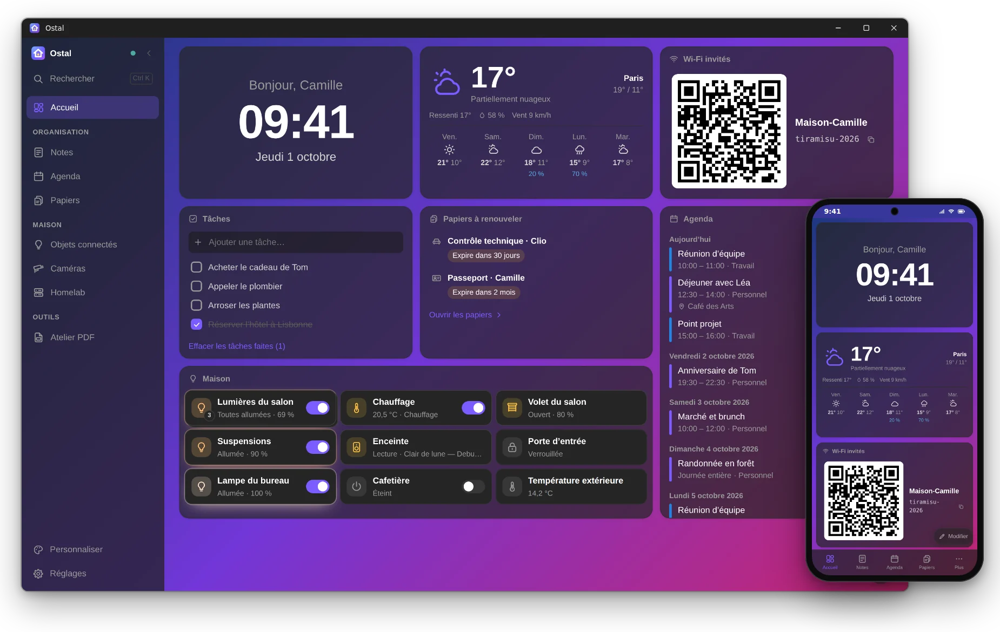
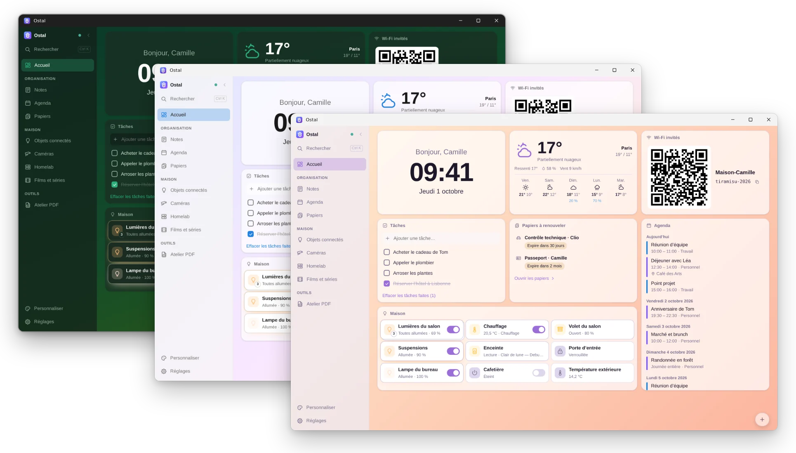
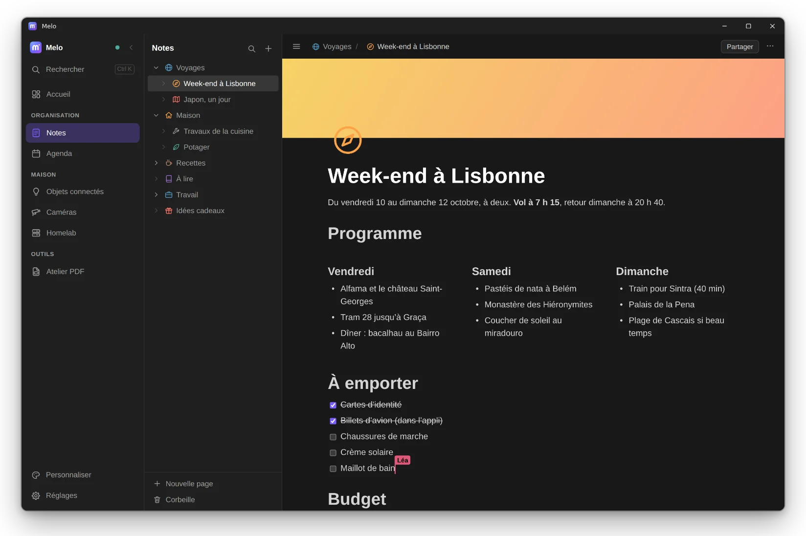
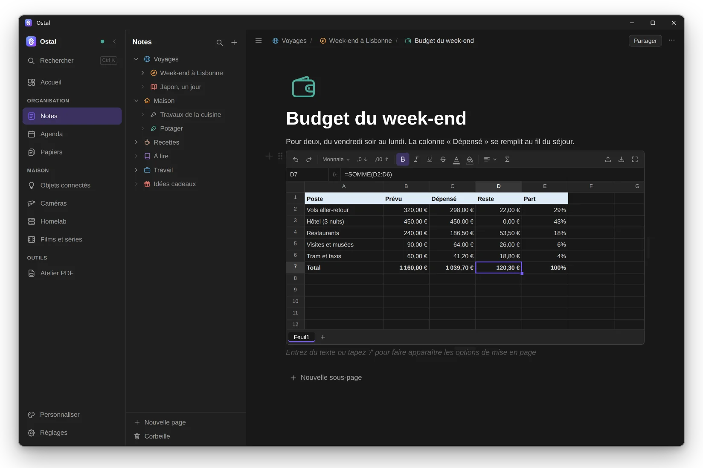
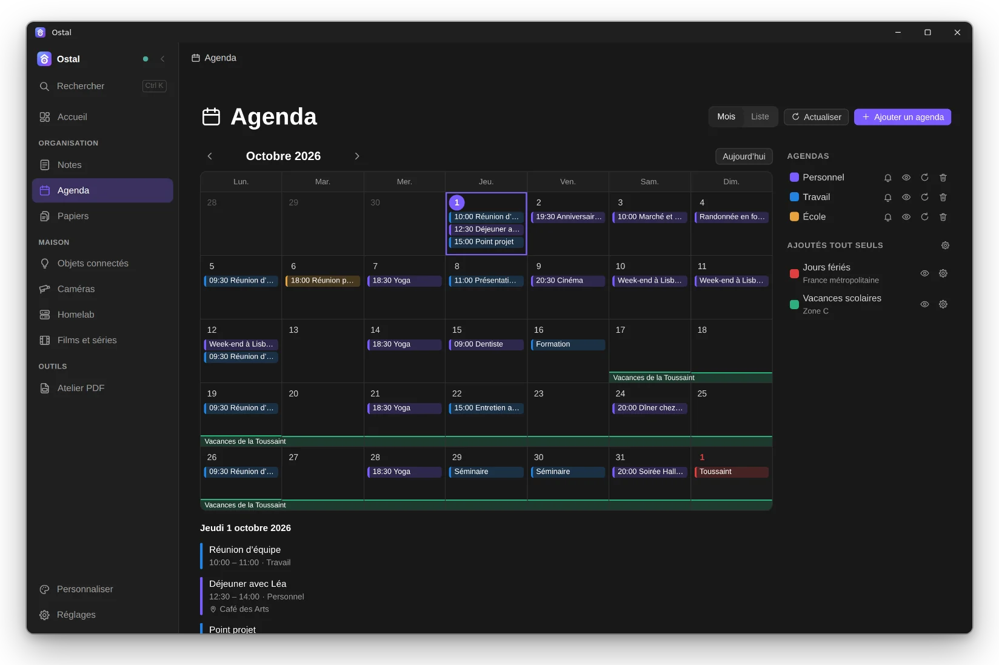
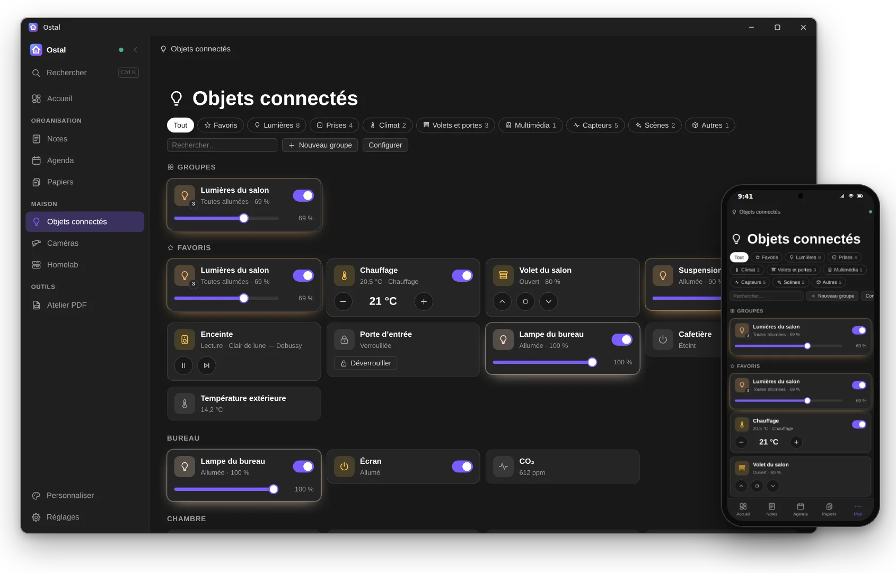
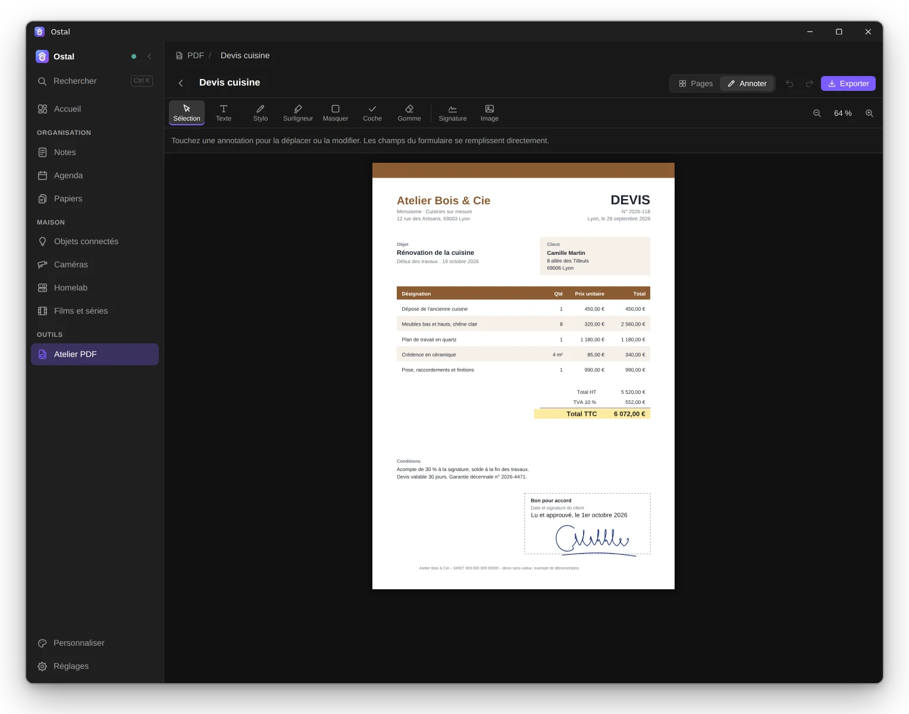
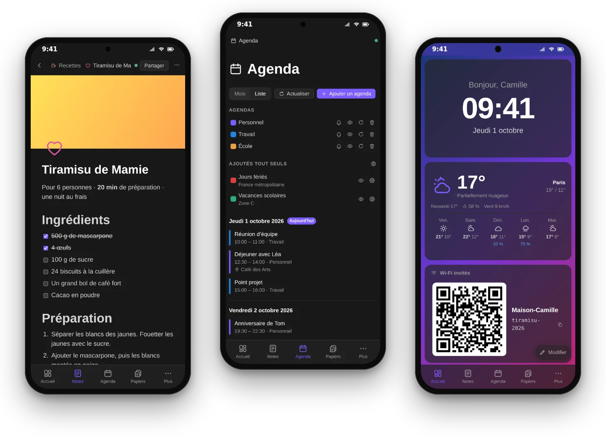

# Melo

**Votre accueil, vos notes, votre agenda et votre maison, réunis dans une seule appli.** 
Gratuite, sans compte, sur Windows, Android et dans le navigateur.

&nbsp;

## 🏠 Un accueil qui vous ressemble

Météo, agenda, tâches, post-it, raccourcis, lumières du salon… Glissez vos widgets où vous voulez, choisissez un fond d’écran et un thème : en deux minutes, Melo est chez vous.

## 📝 Des notes, à plusieurs et en direct

Titres, listes, cases à cocher, tableaux, colonnes, images : tapez `/` et tout est là. Rangez vos pages les unes dans les autres. Partagez une page par un simple lien : vos proches l’ouvrent dans leur navigateur et écrivent avec vous, en même temps.

## 📊 Un tableur, comme dans Excel

Tapez `/tableau` dans une page : formules en français (`SOMME`, `SI`, `RECHERCHEV`…), euros, pourcentages, dates, plusieurs feuilles. Copiez-collez avec Excel, ouvrez vos fichiers `.xlsx` dans Melo et exportez vos tableaux pour Excel.

## 📅 Tous vos agendas au même endroit

Google, Outlook, Apple, le travail, l’école : un seul calendrier, chaque agenda dans sa couleur, sur l’accueil et dans sa propre section.

## 💡 La maison sous la main

Lumières, volets, chauffage, prises, enceintes : tout se pilote d’un geste, pièce par pièce, grâce à Home Assistant. Allumez tout le salon d’un seul bouton, votre PC à distance, et suivez vos caméras en direct et l’état de votre serveur maison.

## ✍️ Signez un PDF en trente secondes

Surlignez, écrivez, signez, remplissez un formulaire, réorganisez les pages ou assemblez plusieurs PDF. Tout se passe dans Melo : vos documents ne partent sur aucun site inconnu.

## 📱 Partout avec vous

Ordinateur, téléphone, tablette : tout se synchronise. Un QR code suffit pour retrouver vos pages sur le téléphone, et Melo fonctionne même sans Internet.

## Télécharger Melo

- 💻 **Windows** : [Melo-Windows.exe](https://github.com/ShinezeoGame/Notes/releases/download/latest/Melo-Windows.exe). Ouvrez-le, Melo s’installe tout seul. Si Windows affiche « Windows a protégé votre ordinateur » : **Informations complémentaires**, puis **Exécuter quand même**.
- 🤖 **Android** : [Melo-Android.apk](https://github.com/ShinezeoGame/Notes/releases/download/latest/Melo-Android.apk). Ouvrez-le sur le téléphone, puis **Installer**.
- 🌐 **Navigateur** : ouvrez l’adresse d’un serveur Melo, le vôtre ou celui d’un proche.

Au premier lancement, Melo s’affiche en anglais : touchez **Français** en haut de l’écran, puis **Commencer**. Un proche vous a envoyé un lien ou un code ? **J’ai une invitation ou un code**.

## Pour aller plus loin

- 📖 [Mode d’emploi](docs/GUIDE.md) : chaque section en détail.
- 🏡 [Installer votre serveur Melo](INSTALLATION.md) : pour synchroniser vos appareils et partager avec vos proches.
- 🛠️ [Développement](docs/DEVELOPPEMENT.md) : construire Melo, architecture.
